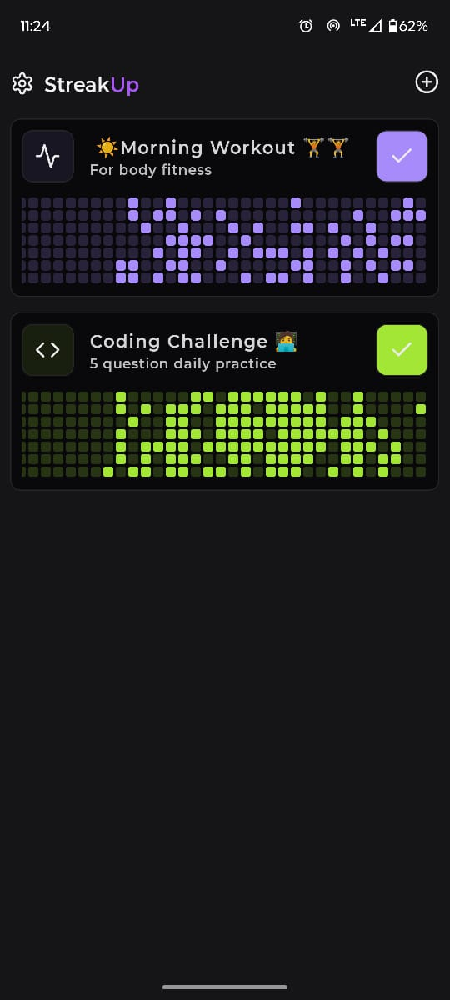
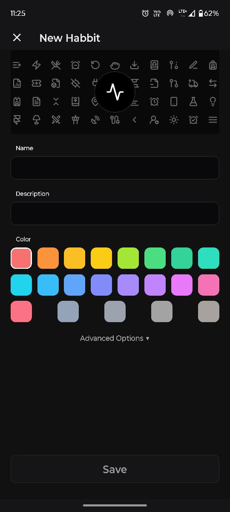
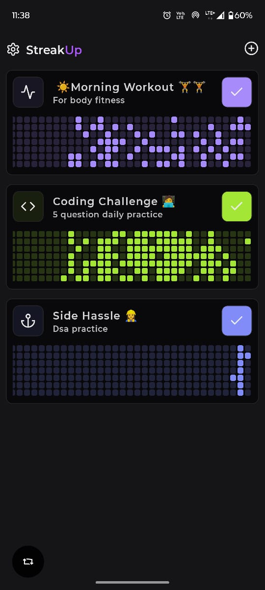
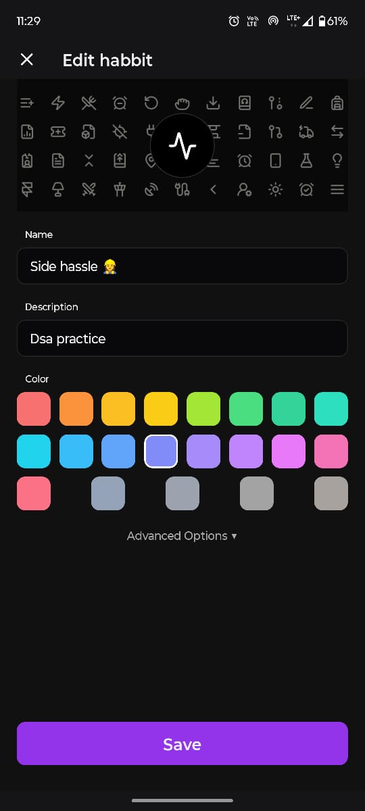
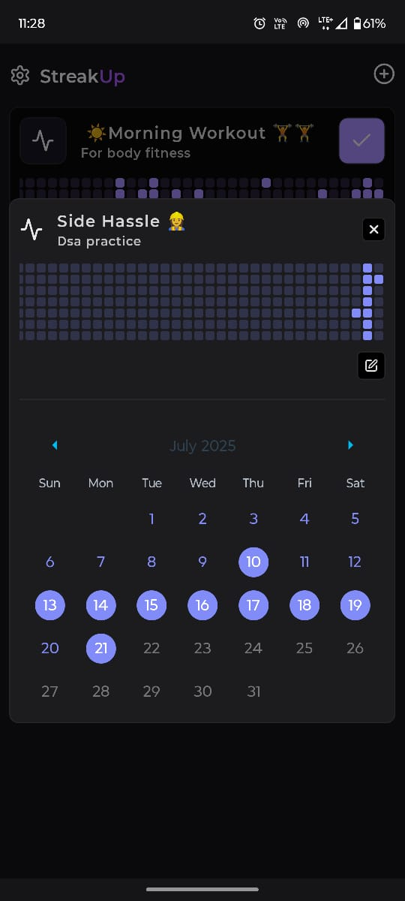
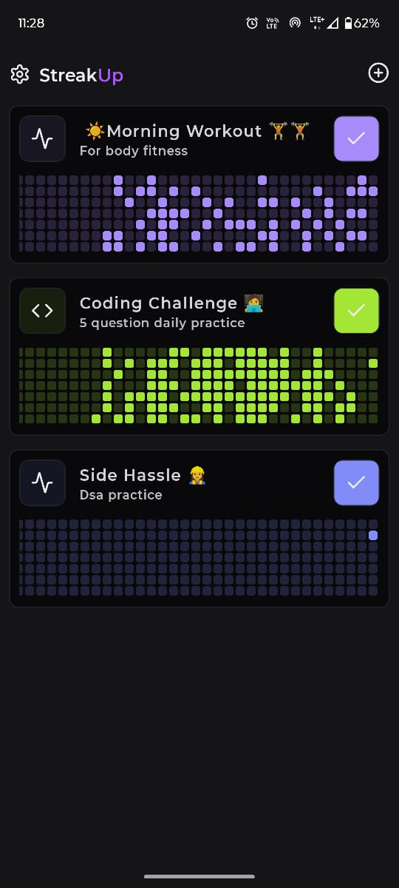
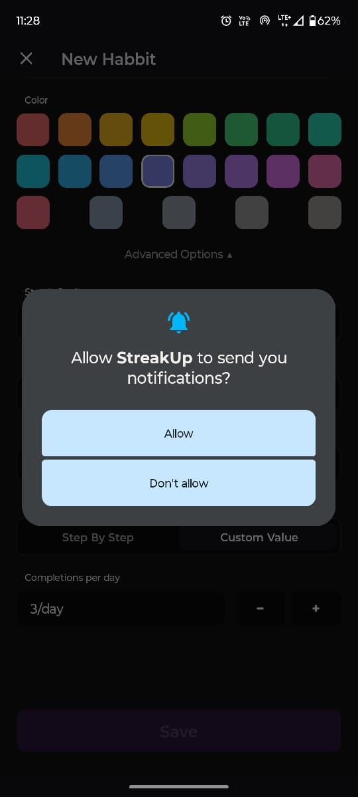
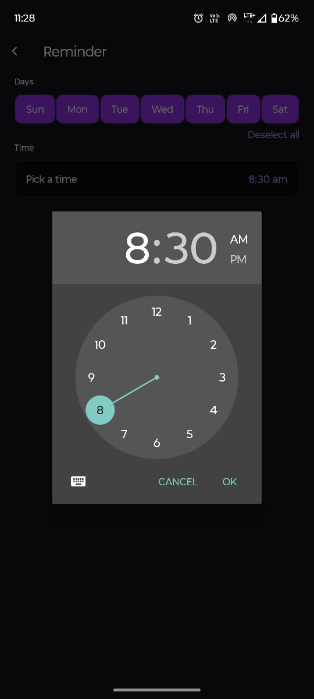
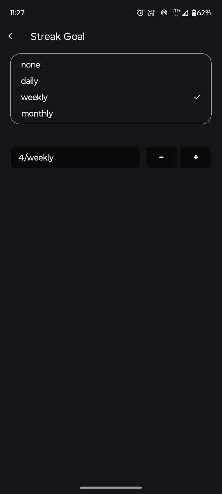
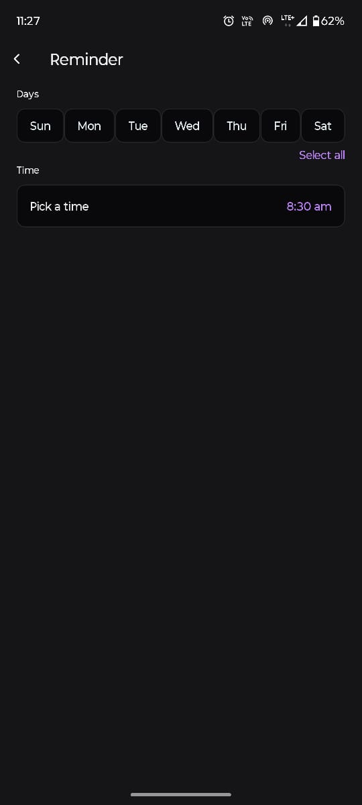

# 💪 HabitKit Clone – Offline Habit Tracker

A HabitKit-style local-first habit tracking app built with **React Native** and **SQLite**, offering a clean UI, offline support, and customizable features.

## 🚀 Features
- ✅ Offline-first with SQLite (no internet required)
- 🎨 Custom icons and colors for habits
- 🔁 Recurring habit tracking
- 📱 Optimized UI inspired by HabitKit

## 📸 Screenshots

<p align="center">
  
  
  
  
  
  
  
  
  
  
  
</p>

## 🛠️ Tech Stack
- React Native
- Nitro SQLite
- Custom Modal & Form UI

## 📦 Installation

```bash
git clone https://github.com/yourusername/yourapp.git
cd yourapp
npm install
npm run android
